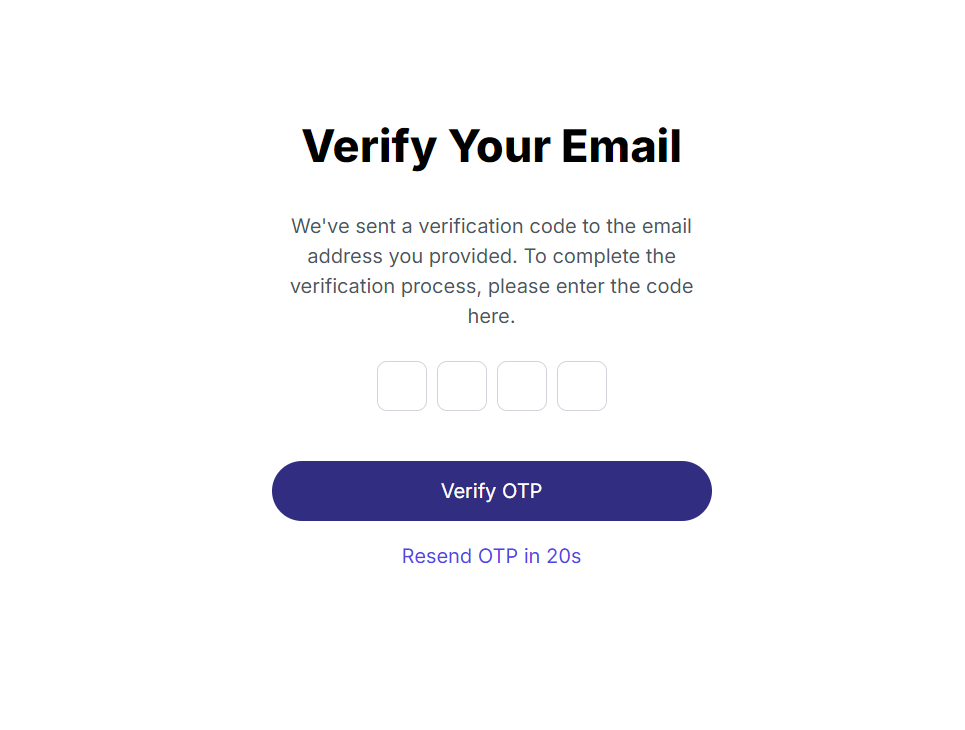

# 📝 Job Listing Website with Next.js
## 🌟 Overview
Welcome to our Job Listing Application, built with the power of Next.js and TypeScript. This project fetches job data from a local JSON file and uses Next.js for seamless routing, ensuring a smooth user experience.

## 👤 Account and authentication page
 It has sign in and sign up pages with custome logic applied on them. Also after signing up your credentials should be verified. So for that purpose the verification page is also added and you can see those three pages below:

 - here is sign in page
 - this page is for users that had created account before
 - the only thing you have to provide is your email and password

    

 - here is sign up page
 - this page is for users that visits the website for the first time
 - optionally it provide google sign in that uses your google account
 - otherwise you should your email to create new account 
    

 - here is verification page
 - that appears after you have signed up with new account
 - this page ensure that you are actaully using your own email 

    

## 🏠 Landing Page
The landing page displays a comprehensive list of job opportunities, along with the total number of available positions under the main heading. Although sorting functionality is currently in development, the interface is designed to be intuitive and user-friendly.
    

## 📋 Details Page
Dive deeper into job listings with our detailed view page, which expands on the information presented on the landing page, providing thorough insights into each job opportunity.
    
    

## 🚀 Conclusion
This project showcases the interface capabilities of Next.js. Stay tuned for future updates, as we plan to introduce exciting new features and enhancements!
