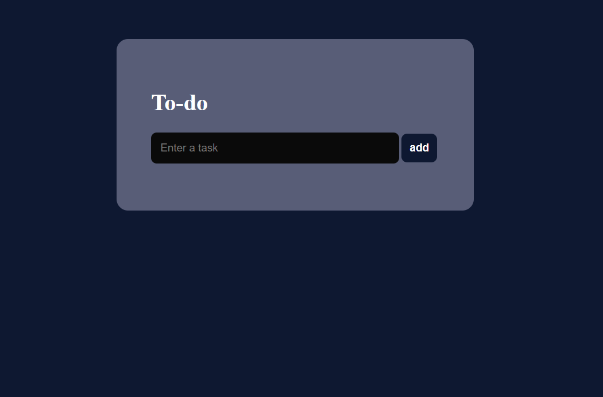
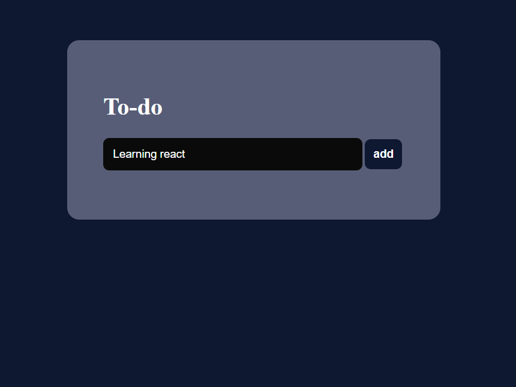
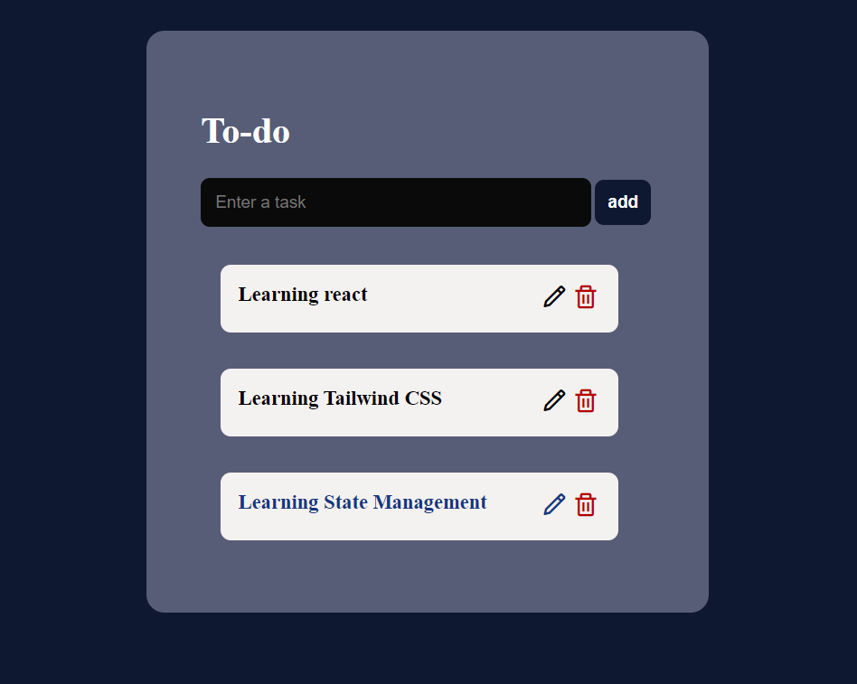
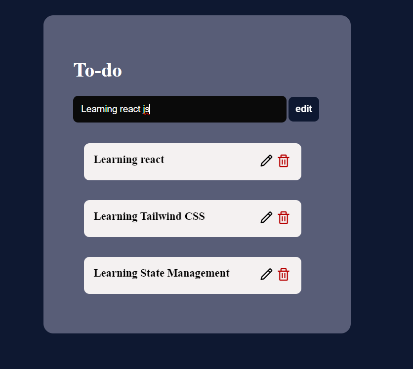
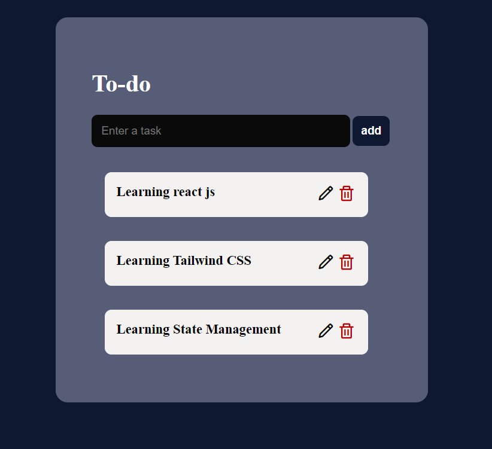
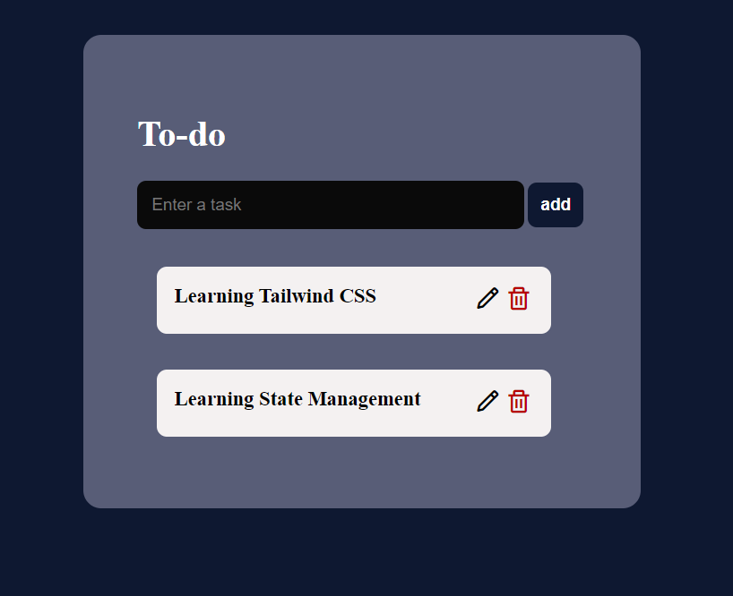

# React made Todo app

## Overview

It is a to do app with beautiful interface made with react library. It has the functionality to add, edit and delete a task.

## Instruction to usage

- initailly the app look like this:
  

## Adding a task

- If you want to add a task and create new list you have to first type the task you want to do on the input field:
  
- Then you click the "add" button that is next to the input field, then the task will be come at the bottom of input field with the order of your input:
- You can add multiple task following this step
  

## Editing a task

- At some point you might need to edit the task you previously added. To do so you just have to click on the pencil icon that represent edit action. Then in the input field it show you the task while the button change to "edit". All you have to do is change the task content and click on edit:
  

- The result will change the task content
  

## Deleting a task

- After this you might want to delete completed tasks. You can click on the trash can icon that is red and located beside the pencil icon. With a single click you can remove a task. For illustration let's delete the edited task and this results in:

  

Following this way you can use this to-do app effectively.
