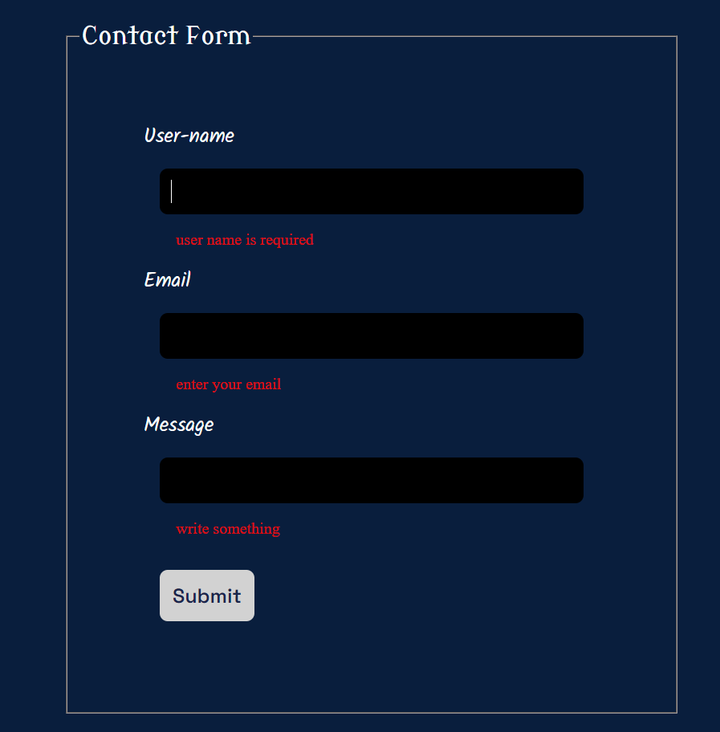
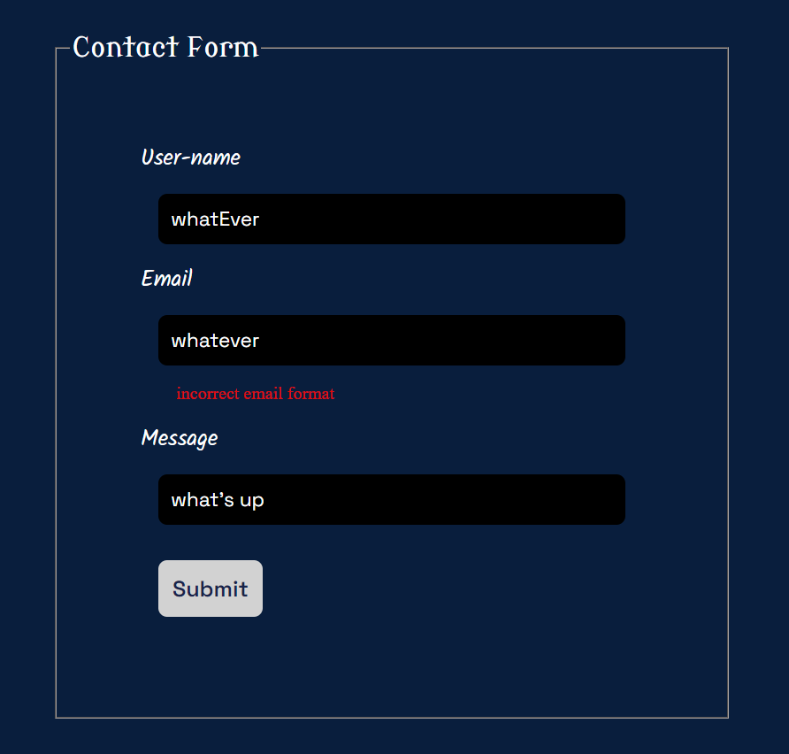
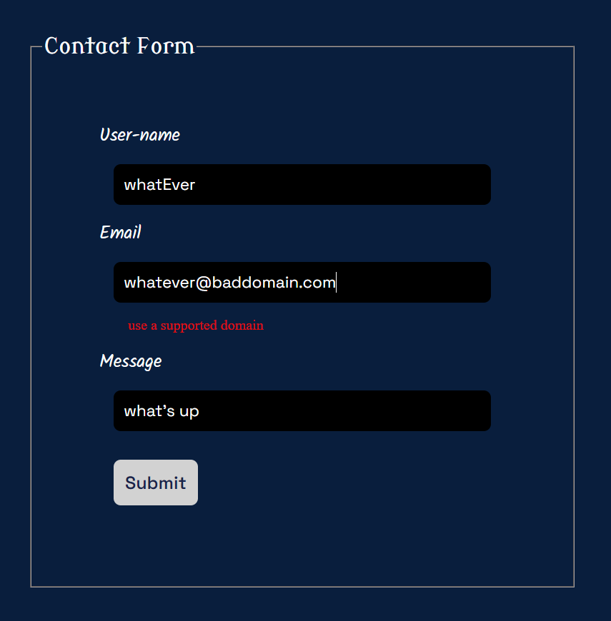

# Contact form done using react hook form
## overview
This repository contains a contact form that is done by react using react hook form. This tool is much easier to handle the state the validation and other related things with form handling. It is much easier than manual form handling with states and other hooks. So let's see the task that is done.

# The UI of contact form
 Initially, let's see the UI:
  Task5/src/assets/image-1.png
 
# What does it validate
## 1. If we didn't enter nothing at all
 If we didn't enter nothing at all and try to submit the form the required error will pop us asking us to enter something.
 
## 2. If we enter wrong email format
 Let's enter wrong email format like "whatever", it will different error message:
 
 

## 3. If uses invalid email domain
 Domain like "@baddomain.com" are domains that do not exist. So we can filter this kinda input with custom validation and our form are able to handle it to as such with different error message.
 

 ## Conclusion
  React hook form is much more efficient and easy way to manage or handle contact forms. 