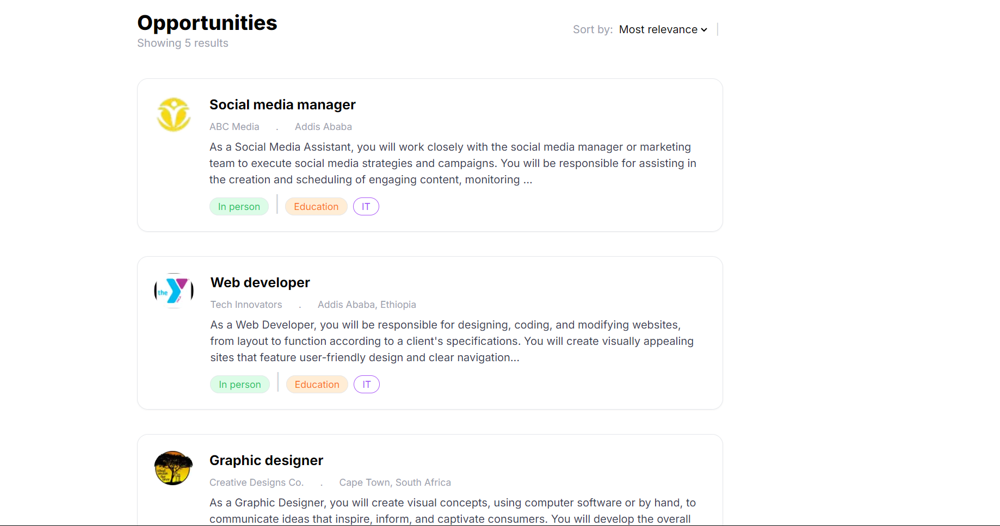
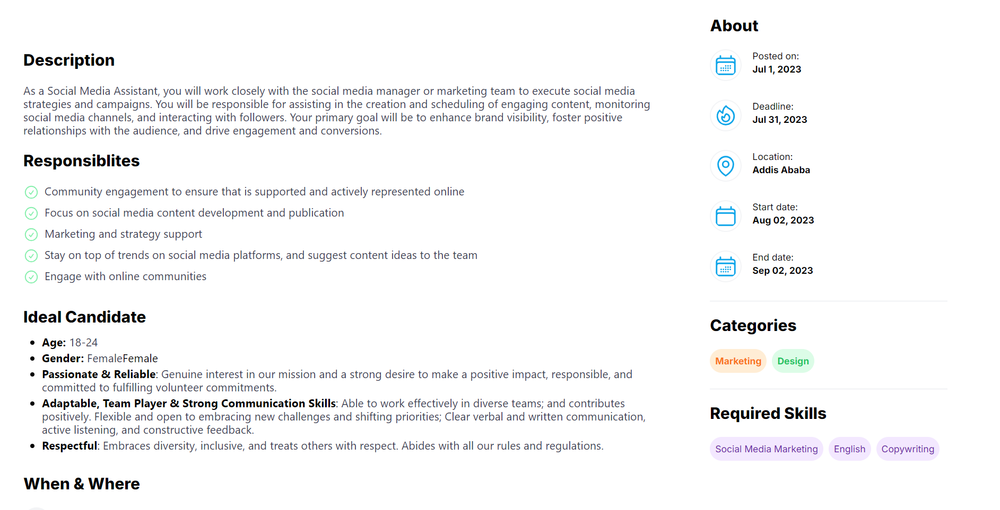
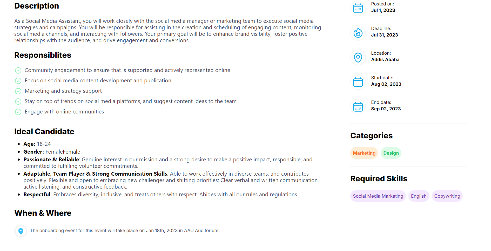

📝 Job Listing Website with Next.js
🌟 Overview
Welcome to our Job Listing Application, built with the power of Next.js and TypeScript. This project fetches job data from a local JSON file and uses Next.js for seamless routing, ensuring a smooth user experience.

📄 Pages
🏠 Landing Page
The landing page displays a comprehensive list of job opportunities, along with the total number of available positions under the main heading. Although sorting functionality is currently in development, the interface is designed to be intuitive and user-friendly.

📋 Details Page
Dive deeper into job listings with our detailed view page, which expands on the information presented on the landing page, providing thorough insights into each job opportunity.

🚀 Conclusion
This project showcases the interface capabilities of Next.js. Stay tuned for future updates, as we plan to introduce exciting new features and enhancements!